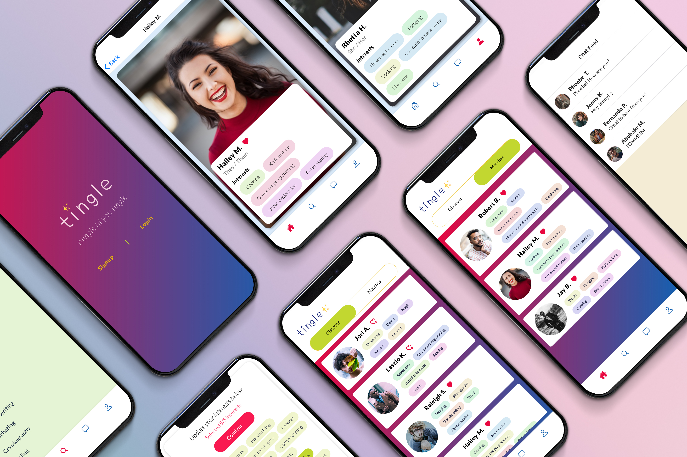

<h1 align="center">

</h1>

Social media application that strives to connect people, one interest at a time.

<h1 align="center">

</h1>

## Table of Contents

- [Introduction](#introduction)
- [Getting Started](#getting-started)
- [Tech Stack](#tech-stack)
- [Features](#features)
- [Notes on Development](#notes-on-development)
- [Next Steps](#next-steps)
- [Developers](#developers)
- [Disclaimer](#disclaimer)

## Introduction

Tingle is a social media mobile application that cultivates connections between people through selected niche interests. Users can choose from a list of 150+ interests, ranging from computer programming, macrame, to urban exploration.

## Getting Started

## Tech Stack

- React Native
- Redux
- Firebase (Cloud Firestore & Authentication)
- Cloudinary
- Expo

## Features

See Tingle in action!

## Notes on Development

## Next Steps

## Developers

Meet the team behind Tingle!

- Karen Choi - [Github](https://github.com/DevKarenC) | [LinkedIn](https://www.linkedin.com/in/seungahchoi/)
- Torie Kim - [Github](https://github.com/toriekim) | [LinkedIn](https://www.linkedin.com/in/victoriakim20/)
- Fernanda Penfold - [Github](https://github.com/fernandapenfold) | [LinkedIn](https://www.linkedin.com/in/fernandapenfold/)

## Disclaimer
